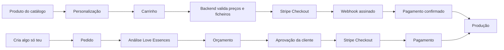

# Arquitetura de comércio — Love Essences

## Decisão

O checkout online principal é **Stripe Checkout**, ligado a **Supabase** e ao frontend estático em **Cloudflare Pages**. O envio transacional usa **Resend**. O bucket Supabase `private-references` guarda as referências sem acesso público.

A myPOS mantém-se para pagamentos presenciais e pode ser acrescentada mais tarde a um orçamento específico. A base de dados já inclui `payment_provider` (`stripe`, `mypos`, `manual`), mas a cliente vê um só checkout no percurso normal. Não há vantagem suficiente em introduzir um segundo checkout agora: embora a myPOS possa ser competitiva em cartões e disponibilize Apple Pay, Google Pay e PayLinks, a documentação pública consultada não oferece a mesma combinação clara de MB WAY + Klarna com seleção dinâmica e um único fluxo de webhooks.

## Percursos



O formulário personalizado nunca cria automaticamente um pagamento. Um checkout de projeto só pode ser criado para um orçamento com estado `sent`/`approved`, através de `quote-checkout`.

## Segurança e integridade

- O browser envia códigos de produto/variante, quantidade e personalização. Preços, mínimos, adicionais, campanhas e portes são recalculados no backend.
- Chaves `service_role`, Stripe secret e webhook secret existem apenas nas variáveis das Supabase Edge Functions.
- Os anexos aceitam JPG, PNG e PDF até 10 MB. O backend confirma tamanho, assinatura binária (magic bytes) e SHA-256 depois do upload.
- O bucket é privado. O admin recebe apenas links de download assinados por 5 minutos.
- O acesso público a encomendas usa tokens aleatórios cujo hash é guardado na base de dados.
- Webhooks são verificados com a assinatura Stripe e registados idempotentemente em `webhook_events`.
- A área administrativa exige utilizador previamente convidado, registo em `admin_users` e MFA AAL2. Não existe registo público.
- O estado de pagamento (`payment_status`) é independente do estado operacional (`order_status`).
- Os dados Stripe guardam Checkout Session, Payment Intent, Charge, Balance Transaction, bruto, taxas, líquido e reembolsos.
- `notification_outbox` aceita os canais `email` e `whatsapp`; nesta fase apenas o email está ligado. O telefone da cliente e o estado idempotente da notificação já permitem acrescentar a WhatsApp Business API sem colocar o checkout no WhatsApp.
- Rate limiting e Turnstile opcional protegem a criação de uploads e pedidos.

## Métodos Stripe

O backend não fixa `payment_method_types`. O Stripe Checkout usa métodos dinâmicos configurados na Dashboard, apresentando apenas o que é elegível para o montante, moeda, dispositivo e país da cliente. Em modo de teste devem ser ativados:

- cartões de débito/crédito;
- MB WAY;
- Apple Pay e Google Pay (wallets sobre cartões elegíveis);
- Klarna, apenas quando a Stripe considerar a transação elegível.

`allow_promotion_codes` já está ativo em sessões de catálogo e de orçamento. As tabelas `promotion_rules` e os snapshots na encomenda evitam redesenhar o checkout quando forem criados cupões.

## Componentes

- `supabase/migrations/202608210001_commerce.sql`: esquema, RLS, bucket privado e auditoria.
- `supabase/seed.sql`: catálogo e preços validados pelo servidor.
- `supabase/functions`: checkout, uploads, projetos, orçamentos, webhooks, estado público e API admin.
- `assets/js/commerce.js`: integração discreta no site atual.
- `admin/`: área de consulta e operação.
- `_headers`: CSP e cabeçalhos de segurança para Cloudflare Pages.

## Configuração de desenvolvimento (sem custos pagos)

1. Criar um projeto **Supabase Free** numa região europeia e aplicar migration + seed.
2. Criar/usar uma conta Stripe em **test mode**; ativar os métodos elegíveis na Dashboard de teste.
3. Definir os secrets das Edge Functions a partir de `supabase/functions/.env.example`.
4. Configurar na Stripe o webhook de teste para `.../functions/v1/stripe-webhook` com os eventos:
   - `checkout.session.completed`
   - `checkout.session.async_payment_succeeded`
   - `checkout.session.async_payment_failed`
   - `payment_intent.payment_failed`
   - `charge.refunded`
   - `charge.refund.updated`
   - `refund.created`
   - `refund.updated`
   - `refund.failed`
5. Preencher `assets/js/commerce-config.js` apenas com URL Supabase e chave `anon`, e mudar `enabled` para `true`.
6. Convidar a proprietária pelo Supabase Auth, desativar sign-up, inserir o `user_id` em `admin_users` com papel `owner` e ativar MFA no primeiro acesso.
7. Em Resend, durante testes pode usar-se o domínio de sandbox. O domínio real só deve ser verificado antes de produção.

Exemplo para criar a proprietária depois do convite (executar no SQL Editor com o UUID real):

```sql
insert into public.admin_users (user_id, role, display_name)
values ('UUID-DO-UTILIZADOR', 'owner', 'Love Essences');
```

## Passagem a produção — requer aprovação prévia

Não foi feita nenhuma alteração paga, compra, publicação, mudança de DNS ou ligação ao domínio. Antes da entrada em produção é necessário apresentar para aprovação:

1. passagem Supabase Free → Pro;
2. plano/limites de Cloudflare Pages, se o uso real ultrapassar o gratuito;
3. ativação live da Stripe e respetivos métodos/contrato Klarna;
4. verificação do domínio no Resend;
5. migração de DNS para Cloudflare e janela de mudança;
6. política de retenção, backups e eventual cópia dos objetos privados para R2.

R2 fica deliberadamente fora da primeira fase. As cópias de base de dados do Supabase não incluem os objetos Storage, por isso o backup de anexos deve ser implementado antes de produção ou assim que o volume justificar.
